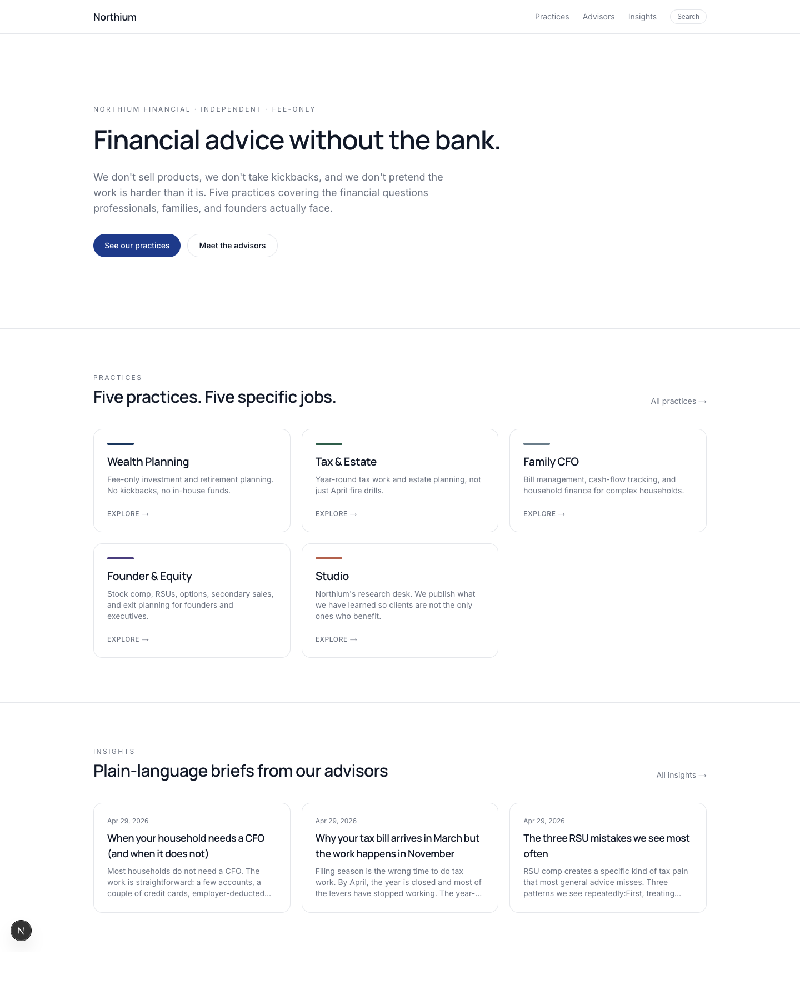
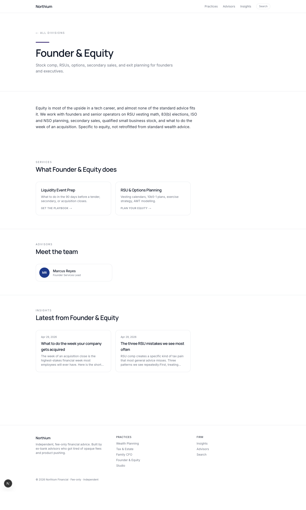
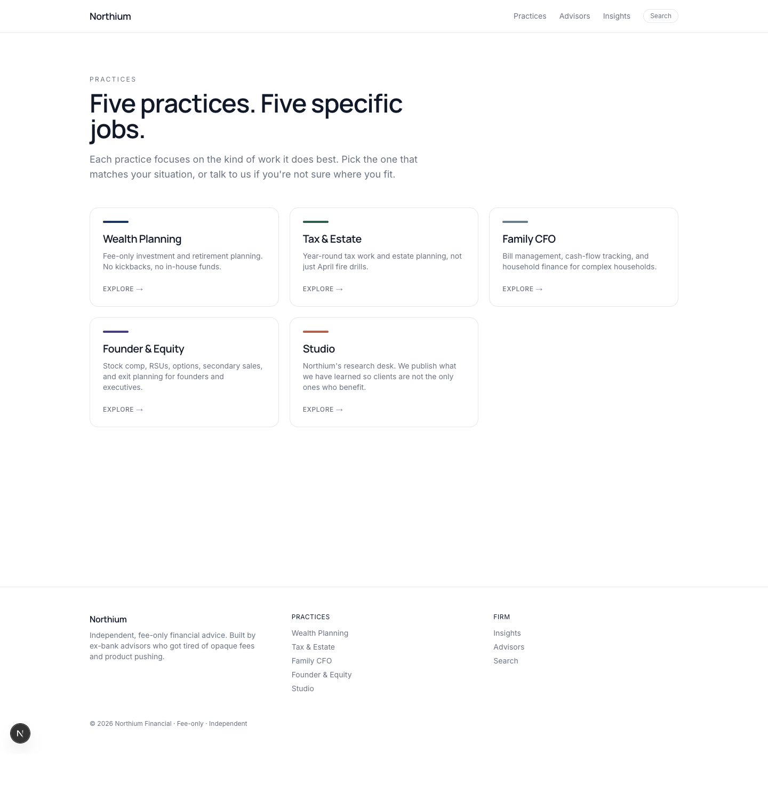
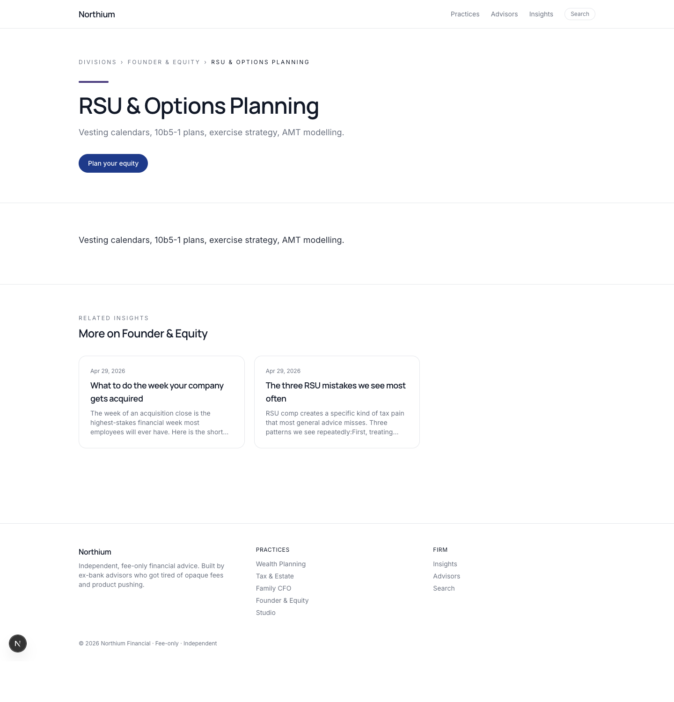
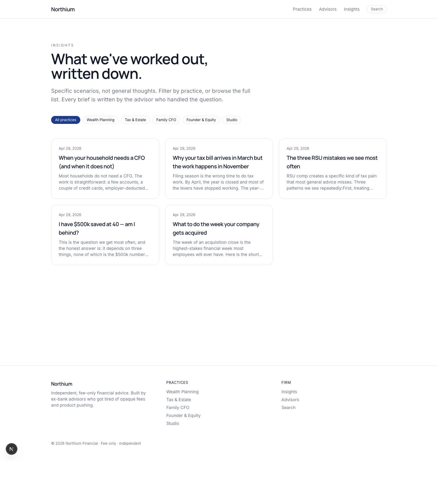
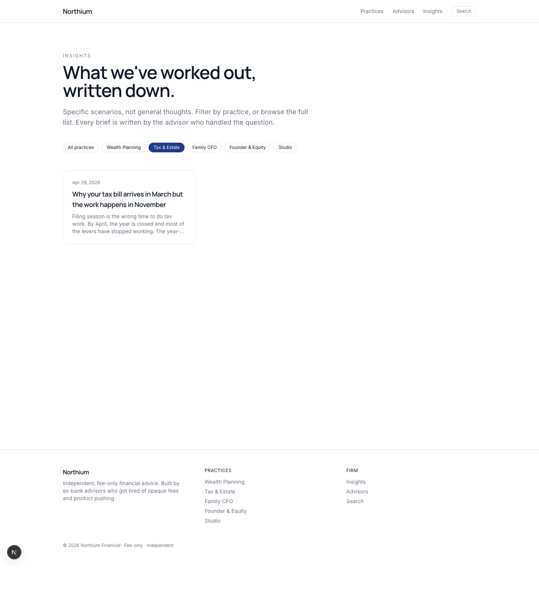
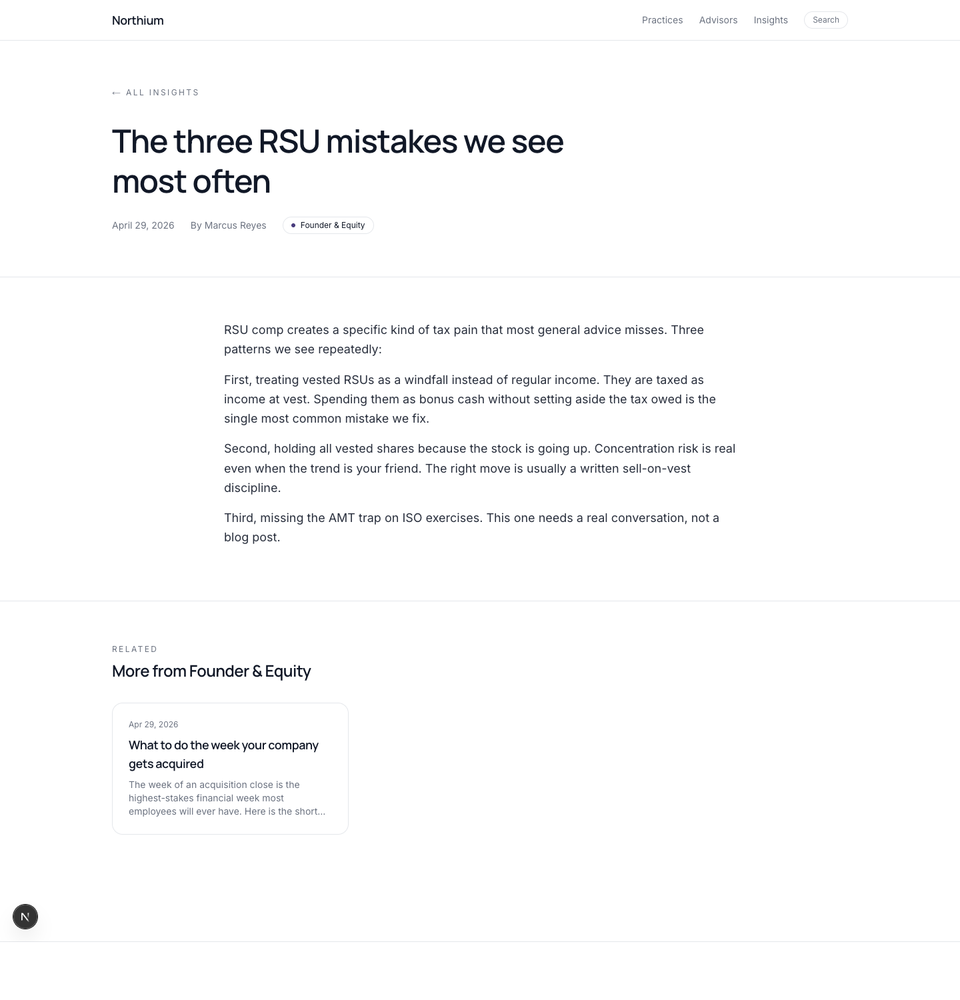
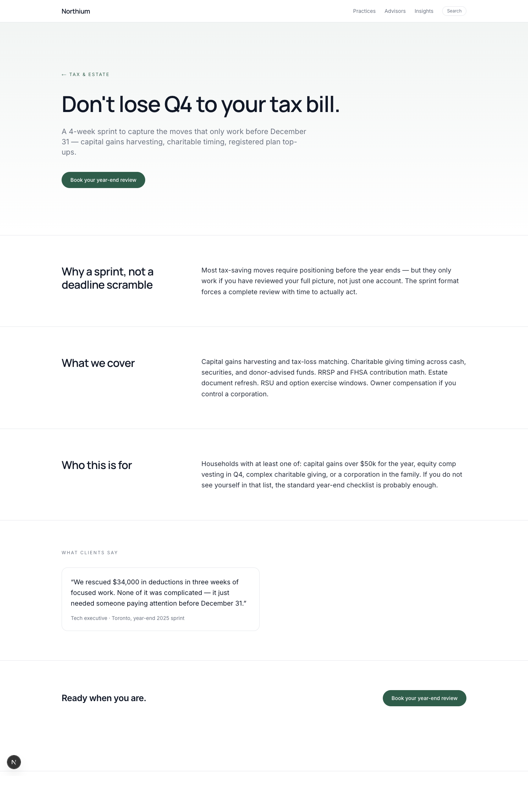
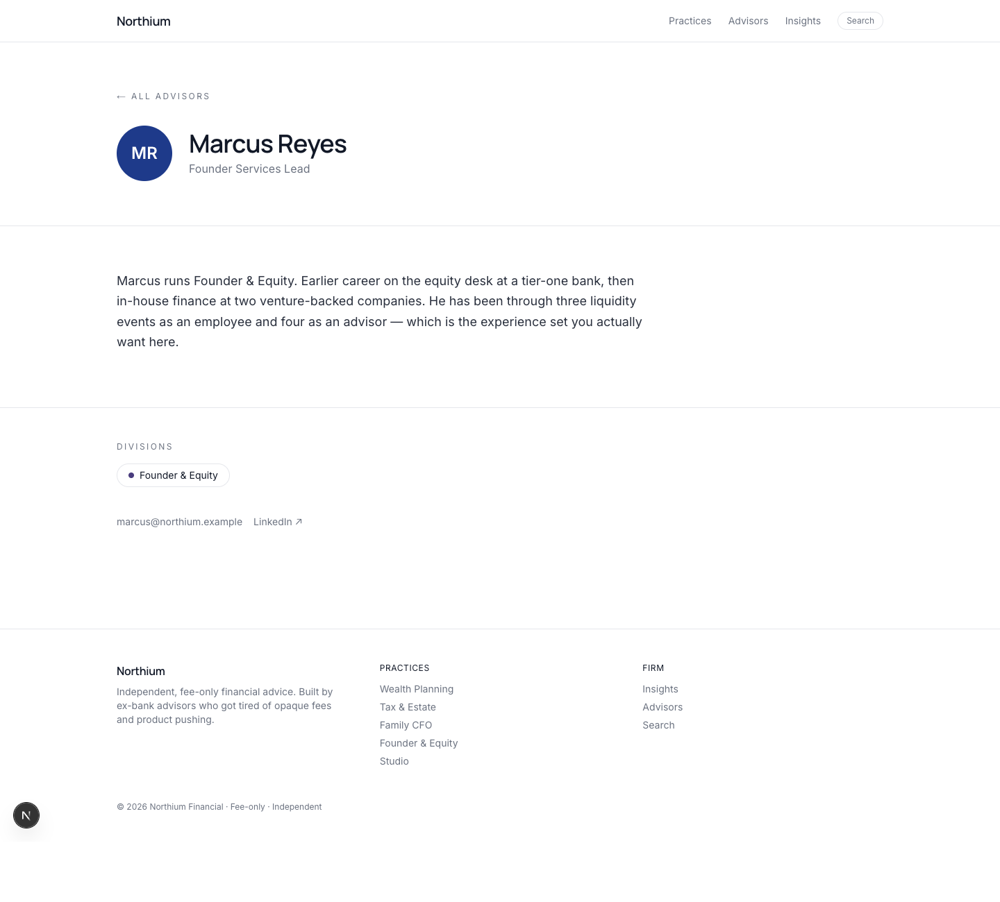

# Headless WordPress Multi-Practice CMS — Northium Financial

## Overview

A headless CMS built with WordPress as the backend and Next.js as the frontend.

The system is designed for a multi-practice financial advisory firm where content is structured by practice, reused across pages, and delivered through a fast, modern frontend.

---

## Problem

Traditional WordPress themes tightly couple content and presentation, making it difficult to scale, keep performance high, and model complex content structures such as multiple specialized practices, productized services, and advisor profiles linked to both.

---

## Solution

This project decouples WordPress from the frontend:

# headless-wordpress-division-cms

* WordPress handles structured content, the editor experience, and admin auth
* Next.js consumes content via a custom REST API and renders fast, SEO-friendly pages
* A revalidate webhook from WordPress keeps the frontend cache fresh without redeploys

---

## Key Features

### Content Modeling (WordPress)

* Divisions — five practices: Wealth Planning, Tax & Estate, Family CFO, Founder & Equity, Studio
* Services linked to a division (productized: "The Annual Plan", "RSU & Options Planning", etc.)
* Advisors linked to one or more divisions
* Articles (briefs) linked to a division and an advisor author
* Campaign pages (marketing landing pages) targeting a division

### Frontend (Next.js)

* Dynamic routing for divisions, services, advisors, articles, campaigns, search
* Incremental Static Regeneration via cache tags
* Practice-aware UI components with archetype-driven accent colors
* JSON-LD, sitemap, and robots.txt for SEO

### Core Feature

* Practice-based content filtering:

  * Selecting a practice loads its services, advisors, and related articles in a single API call
  * Filter chips on the insights page are URL-driven, shareable, and SEO-friendly

---

## Architecture

```text
User → Next.js Frontend → WordPress REST API → WordPress CMS + northium-cms plugin → MySQL
                ↑                                              │
                └──────────── revalidate webhook ──────────────┘
```

### Responsibilities

* WordPress:

  * Content management
  * Custom post types and taxonomies
  * Custom REST endpoints under `northium/v1`
  * Outbound revalidate webhook on save_post / delete_post

* Next.js:

  * UI rendering and routing
  * Typed data fetching with ISR + cache tags
  * `/api/revalidate` route handler that maps webhook payloads to `revalidateTag()` calls

---

## Tech Stack

* WordPress 6 / PHP 8.3 / MySQL 8
* Next.js 16 / React 19 / TypeScript
* Tailwind CSS v4 (`@theme inline` tokens)
* Inter + Manrope (via `next/font`)
* Docker Compose (local development)

---

## Project Structure

```text
wp-content/
  plugins/northium-cms/
    northium-cms.php
    includes/
      cpts.php · taxonomies.php · meta.php
      seed.php · webhook.php
      rest/   (helpers + 9 endpoints)
  themes/  (minimal admin-only stub)

web/
  app/
    divisions/[slug]/
    services/[slug]/
    advisors/[slug]/
    insights/[slug]/
    campaigns/[slug]/
    search/
    api/revalidate/
    sitemap.ts · robots.ts
  components/
  lib/api.ts · types.ts · env.ts

docker/
  docker-compose.yml

docs/   (full design + implementation docs)
```

---

## API Examples

Default WP endpoints:

```text
/wp-json/wp/v2/division
/wp-json/wp/v2/service
/wp-json/wp/v2/advisor
```

Custom composed endpoints (single-call hubs that avoid waterfall fetches):

```text
/wp-json/northium/v1/divisions
/wp-json/northium/v1/division/{slug}
/wp-json/northium/v1/service/{slug}
/wp-json/northium/v1/insights
/wp-json/northium/v1/insights/{slug}
/wp-json/northium/v1/campaign/{slug}
/wp-json/northium/v1/search?q=...
```

---

## Setup (Local Development)

### 1. Start WordPress

```bash
cd docker
docker compose up -d
```

Install WordPress and activate the plugin:

```bash
docker compose run --rm wpcli core install \
  --url=http://localhost:8080 --title="Northium" \
  --admin_user=admin --admin_password=admin \
  --admin_email=admin@northium.local --skip-email
docker compose run --rm wpcli rewrite structure '/%postname%/' --hard
docker compose run --rm wpcli plugin activate northium-cms
docker compose run --rm wpcli northium seed
```

Access:

```text
http://localhost:8080         (frontend of WP — not used directly)
http://localhost:8080/wp-admin
http://localhost:8083         (Adminer)
```

### 2. Start Next.js

```bash
cd web
npm install
cp .env.example .env.local
npm run dev
```

Access:

```text
http://localhost:3000
```

---

## Key Implementation Details

### Custom Post Types

* Registered through the plugin (not the theme), so content survives any theme switch
* Each CPT exposed via REST with `'custom-fields'` support so meta is included in the response

### Data Fetching

* Centralized typed API layer (`web/lib/api.ts`)
* TypeScript shapes mirror the PHP formatters in `includes/rest/helpers.php`
* Uses `fetch` with `force-cache` + ISR + tags:

```ts
fetch(url, {
  cache: "force-cache",
  next: { revalidate: 300, tags: ["divisions", `division:${slug}`] },
});
```

### Rendering Strategy

* ISR for all content pages, with `generateStaticParams` pre-building known slugs
* Dynamic rendering for search and filtered insights views
* `revalidateTag(tag, "max")` from the revalidate route handler invalidates only the affected cache keys

### Security Considerations

* Public read endpoints require no auth; write paths go through standard WP cookie/nonce flow
* `dangerouslySetInnerHTML` used only for content authored in WordPress (via `apply_filters('the_content')`)
* Revalidate webhook protected by a Bearer secret shared between WP and Next.js
* Frontend never holds secrets — env vars validated at boot, all server-side fetches happen in Server Components

---

## Screenshots

### Homepage


### Practice hub — Founder & Equity (flagship page, single API call assembles everything)


### Practices index


### Service detail — RSU & Options Planning


### Insights index — with practice filter chips


### Insights filtered by practice — active chip state


### Article detail — "The three RSU mistakes we see most often"


### Campaign landing page — Year-End Tax Review 2026


### Advisor profile — Marcus Reyes


---

## Future Improvements

* GraphQL integration (replace or supplement REST)
* JWT authentication for a small client portal
* Preview mode for draft content
* Algolia / Meilisearch for advanced cross-CPT search
* Caching layer (Redis or CDN) in front of WordPress
* French (FR-CA) localization

---

## Author

Laxman KC
GitHub: https://github.com/laxkc
LinkedIn: https://www.linkedin.com/in/laxmankc/
